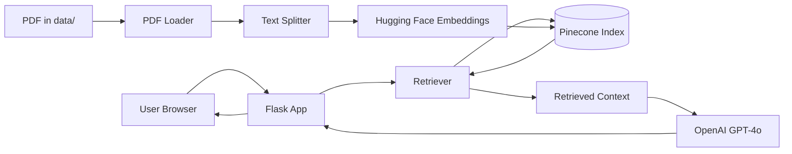
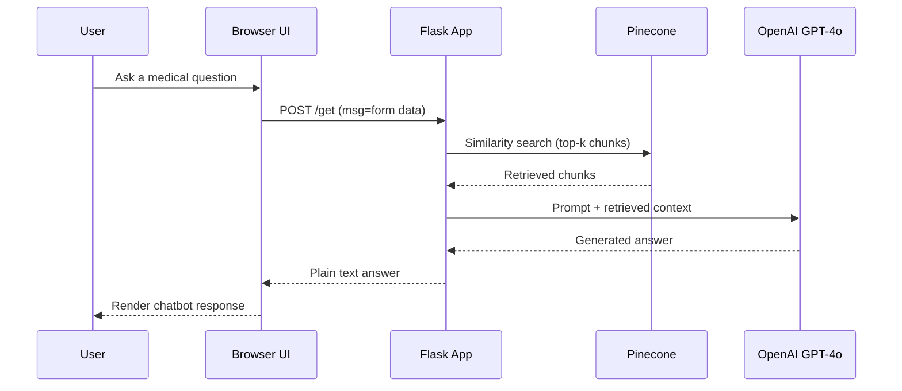

# Medical Chatbot 

## Executive Summary

 This project is a compact Python-based medical question-answering demo built around a browser chat UI, a PDF knowledge base, an embedding model, a vector store, and an LLM-backed retrieval chain. The implementation is structurally sound for a portfolio or proof-of-concept: it ingests a medical PDF, chunks it, embeds it with a entity["company","Hugging Face","ml platform company"] sentence-transformer, stores the vectors in entity["company","Pinecone","vector database vendor"], and answers questions through LangChain plus entity["company","OpenAI","ai company"]’s GPT-4o. That matches the standard retrieval-augmented generation pattern described by LangChain, and the code’s `dimension=384` setting is consistent with Pinecone’s requirement that index dimension match the embedding model’s vector size and with the `all-MiniLM-L6-v2` model card, which states that the model outputs 384-dimensional embeddings. citeturn0search2turn0search9turn2search0turn1search0turn0search6turn5search1

The repository, however, is not yet production-ready for a medical setting. The current `README.md` is only a title, there is no test suite, no CI workflow, no `.env.example`, no Dockerfile, and no explicit privacy, retention, access-control, or data-governance documentation. Two code-level issues are especially important: `app.py` runs Flask with `debug=True`, which Flask explicitly warns must not be used in production, and the code writes possibly missing environment variables directly into `os.environ`, even though Python documents that environment keys and values are strings, so a missing value can become a startup failure instead of a clean configuration error. Flask’s production guidance also points toward using a proper WSGI server such as Gunicorn on Linux/macOS or Waitress on Windows. citeturn11search15turn11search2turn11search1turn11search3turn9search0

The strongest near-term outcome is to keep the current architecture, improve configuration and safety, document the project properly, and add a small engineering baseline: startup validation, tests, CI, containerisation, and explicit medical-data warnings. If the application will ever handle real patient information, the repository should state compliance as unspecified today and treat privacy/security work as a prerequisite, not an afterthought, because U.S. HIPAA rules protect individually identifiable health information and both the entity["organization","European Commission","eu executive body"] and the entity["organization","Information Commissioner's Office","uk regulator"] treat health data as specially protected under GDPR/UK GDPR. citeturn6search8turn6search3turn7search3turn6search10

## Repository Review

From direct inspection, the repository contains `app.py`, `src/`, `templates/`, `static/`, `data/`, `research/`, `requirements.txt`, `setup.py`, `template.sh`, `LICENSE`, and a placeholder `README.md`. The application entry point is `app.py`. The ingestion/indexing entry point is `src/store_index.py`. The knowledge base lives in `data/Medical_book.pdf`. The frontend is a simple Flask-rendered chat template in `templates/chat.html` backed by jQuery AJAX and a custom stylesheet in `static/style.css`. No `package.json`, `Pipfile`, `environment.yml`, `Dockerfile`, or `.github/workflows/` directory is present in the uploaded codebase.

The runtime flow is straightforward. `src/store_index.py` loads PDFs from `data/`, keeps only minimal metadata, splits text into 500-character chunks with 20-character overlap, downloads the `sentence-transformers/all-MiniLM-L6-v2` embeddings model, creates a serverless Pinecone index named `medical-chatbot` in `aws/us-east-1`, and uploads chunk embeddings. `app.py` then loads the same embedding model, connects to the existing index, exposes `/` and `/get`, retrieves top-3 similar chunks, and uses a LangChain retrieval chain plus `ChatOpenAI(model="gpt-4o")` to return a concise answer. The prompt in `src/prompt.py` restricts answers to three sentences and tells the assistant to say “I don’t know” when context is insufficient. This architecture is consistent with LangChain retrieval-chain guidance and with Pinecone’s serverless-index requirements. citeturn0search2turn2search0turn2search15turn1search0turn0search6turn5search1

The detected implementation stack is primarily Python, with HTML, CSS, and inline JavaScript on the frontend. Pinned Python dependencies in `requirements.txt` are: `langchain==0.3.26`, `langchain-core==0.3.83`, `langchain-community==0.3.26`, `langchain-openai==0.3.24`, `langchain-pinecone==0.2.8`, `flask==3.1.1`, `sentence-transformers==4.1.0`, `pypdf==5.6.1`, and `python-dotenv==1.1.0`, plus editable install `-e .`. Frontend libraries are loaded by CDN in `templates/chat.html`: Bootstrap 4.1.x, jQuery 3.2.1 and 3.3.1, and Font Awesome 5.5.0. The stack choices make sense technically, but the dependency story is incomplete: there is no pinned Python runtime version, `setup.py` has an empty `install_requires`, and no dev/test requirements are declared. The installation guidance in the README below follows the standard `venv` and `pip` workflow documented by Python packaging guidance. citeturn0search0turn0search4turn0search13

The most important engineering observations are these. `app.py` does heavyweight initialisation at import time, which makes startup slower and harder to test. The `/get` route advertises both GET and POST, but the handler reads `request.form["msg"]`, so POST with form data is the practical path. `src/helper.py` is cleanly separated, but `filter_to_minimal_docs()` removes page metadata, which limits future source attribution and debugging. `src/store_index.py` hard-codes index name, cloud, region, and embedding dimension. `templates/chat.html` is usable, but it duplicates some CDN assets and has no structured error state. `setup.py` is minimal and should eventually move to `pyproject.toml`. `LICENSE` is already Apache-2.0, so there is no reason to default to MIT here unless you explicitly want a different licensing posture.

| Key file or folder | Current purpose | Suggested improvement |
|---|---|---|
| `app.py` | Flask entry point, retriever, retrieval chain, web routes | Add config validation, better error handling, JSON endpoint option, lazy initialisation, healthcheck, production server support |
| `src/store_index.py` | One-off PDF ingestion and Pinecone indexing | Add CLI args/env config, deduping/idempotency, logging, batching, index-name configurability |
| `src/helper.py` | PDF loading, metadata filtering, chunking, embeddings | Preserve page metadata, add tests and docstrings, parameterise chunk settings |
| `src/prompt.py` | System prompt for concise medical answers | Add medical disclaimer, safety triage, source citation guidance |
| `templates/chat.html` | Browser chat UI | Remove duplicate CDN imports, add loading/error states, sanitise rendering, optionally migrate to JSON API |
| `static/style.css` | Chat styling | Keep as-is; optionally add dark/light theme variables |
| `data/Medical_book.pdf` | Local knowledge base | Document provenance/licence, consider multiple-source corpus support |
| `research/trials.ipynb` | Experimental notebook / prototyping | Clear outputs, summarise learnings in docs, keep notebook non-production |
| `requirements.txt` | Runtime dependencies | Add dev/test/lint extras or separate requirements files; pin direct dependencies used in code |
| `setup.py` | Package metadata | Move to `pyproject.toml`; populate dependencies and package data |
| `README.md` | Placeholder only | Replace with the README below |
| `LICENSE` | Apache-2.0 licence | Keep, and mention it clearly in README |

## Ready-to-Paste README.md

The README below is written to match the uploaded repository as it exists now while clearly labelling Docker, CI, and testing as recommended additions rather than already-committed files. The install steps follow official Python packaging guidance, and the Docker and GitHub Actions patterns align with the current documentation from entity["company","Docker","container platform company"] and entity["company","GitHub","code hosting platform"]. citeturn0search0turn0search4turn1search2turn1search14turn1search1turn12search6

````markdown
# Medical Chatbot


<!-- Optional: add your GitHub Actions status badge after creating .github/workflows/ci.yml -->

A Retrieval-Augmented Generation (RAG) medical chatbot built with Flask, LangChain, Pinecone, OpenAI, and sentence-transformers. The application indexes a medical PDF knowledge base, retrieves relevant context, and answers user questions through a simple browser chat interface.


## Description

This project provides a simple end-to-end medical question-answering workflow:

- load medical PDF documents from `data/`
- split the documents into chunks
- create embeddings with `sentence-transformers/all-MiniLM-L6-v2`
- store vectors in Pinecone
- retrieve relevant chunks for a question
- generate a concise answer with OpenAI GPT-4o
- serve the chatbot through a Flask web UI






## Features

- PDF-based medical knowledge ingestion
- Embedding generation with sentence-transformers
- Vector search using Pinecone
- Retrieval-Augmented Generation with LangChain
- OpenAI GPT-4o answer generation
- Simple Flask + HTML/CSS chat interface
- Concise-answer prompt design
- Clear code structure for further extension

## Tech Stack

**Backend**
- Python
- Flask
- LangChain
- langchain-openai
- langchain-pinecone
- python-dotenv

**LLM / Retrieval**
- OpenAI GPT-4o
- Pinecone vector database
- sentence-transformers `all-MiniLM-L6-v2`

**Document Processing**
- PyPDF
- LangChain document loaders and text splitters

**Frontend**
- HTML
- CSS
- Bootstrap
- jQuery

## Installation

### Prerequisites

Make sure you have:

- Python 3.10 or newer
- A Pinecone API key
- An OpenAI API key

### Linux / macOS

```bash
git clone <your-repo-url>
cd Medical-Chatbot-main

python3 -m venv .venv
source .venv/bin/activate

python -m pip install --upgrade pip
pip install -r requirements.txt
```

### Windows PowerShell

```powershell
git clone <your-repo-url>
cd Medical-Chatbot-main

py -m venv .venv
.\.venv\Scripts\Activate.ps1

python -m pip install --upgrade pip
pip install -r requirements.txt
```

### Windows Command Prompt

```bat
git clone <your-repo-url>
cd Medical-Chatbot-main

py -m venv .venv
.\.venv\Scripts\activate.bat

python -m pip install --upgrade pip
pip install -r requirements.txt
```

### Create the vector index

Run the indexing script once after setting your environment variables:

```bash
python -m src.store_index
```

### Start the web app

```bash
python app.py
```

Then open:

```text
http://localhost:8080
```

### Docker

> This repository does **not** currently include a committed `Dockerfile`.  
> If you want containerised local development, add the following file at the repo root.

```dockerfile
FROM python:3.11-slim

WORKDIR /app

COPY requirements.txt setup.py app.py ./
COPY src ./src
COPY templates ./templates
COPY static ./static
COPY data ./data

RUN python -m pip install --upgrade pip && \
    pip install --no-cache-dir -r requirements.txt

EXPOSE 8080

CMD ["python", "app.py"]
```

Build and run:

```bash
docker build -t medical-chatbot .
docker run --rm -p 8080:8080 --env-file .env medical-chatbot
```

Create the Pinecone index from inside the container if needed:

```bash
docker run --rm --env-file .env medical-chatbot python -m src.store_index
```

## Configuration

Create a `.env` file in the project root:

```env
PINECONE_API_KEY=your_pinecone_api_key
OPENAI_API_KEY=your_openai_api_key
```

### Current hard-coded runtime settings

These values are currently set in code:

- Pinecone index name: `medical-chatbot`
- Embedding model: `sentence-transformers/all-MiniLM-L6-v2`
- Retrieval `k`: `3`
- App host: `0.0.0.0`
- App port: `8080`
- LLM model: `gpt-4o`

### Recommended future config variables

For a production-friendly setup, move these into environment variables:

```env
PINECONE_INDEX_NAME=medical-chatbot
EMBEDDING_MODEL=sentence-transformers/all-MiniLM-L6-v2
OPENAI_MODEL=gpt-4o
TOP_K=3
PORT=8080
FLASK_DEBUG=false
```

## Usage

1. Put your source PDF documents in the `data/` directory.
2. Set your API keys in `.env`.
3. Run the indexing script:
   ```bash
   python -m src.store_index
   ```
4. Start the Flask app:
   ```bash
   python app.py
   ```
5. Open the browser UI at `http://localhost:8080`.
6. Ask a question in the chat box.

## Examples

### Example user prompts

- `What is hypertension?`
- `Explain diabetes in simple terms.`
- `What are the symptoms of asthma?`

### Example API call

The current app expects form data, not JSON:

```bash
curl -X POST http://localhost:8080/get \
  -d "msg=What is hypertension?"
```

Example response:

```text
Hypertension is a condition in which blood pressure remains higher than normal over time. It can increase the risk of heart disease, stroke, and kidney problems. If you have symptoms or concerns, consult a qualified medical professional.
```

## API

The application currently exposes two routes:

| Method | Endpoint | Purpose |
|---|---|---|
| GET | `/` | Render the chat UI |
| POST | `/get` | Accept a user question through form field `msg` and return a plain-text answer |

### Notes

- The current implementation is browser-oriented.
- The response is plain text, not structured JSON.
- If you plan to integrate this with other services, consider adding a proper JSON API such as `/api/chat`.

## Model/Training

This repository does **not** contain a model training or fine-tuning pipeline.

Instead, it uses:

- **Embedding model:** `sentence-transformers/all-MiniLM-L6-v2`
- **LLM:** `gpt-4o`
- **Vector store:** Pinecone
- **Knowledge source:** `data/Medical_book.pdf`

The workflow is retrieval-based rather than training-based:
- documents are loaded
- text is chunked
- chunks are embedded
- embeddings are stored in Pinecone
- relevant chunks are retrieved at query time
- the LLM generates a grounded answer from retrieved context

## Project Structure

```text
Medical-Chatbot-main/
├── app.py
├── requirements.txt
├── setup.py
├── template.sh
├── LICENSE
├── README.md
├── data/
│   └── Medical_book.pdf
├── research/
│   └── trials.ipynb
├── src/
│   ├── __init__.py
│   ├── helper.py
│   ├── prompt.py
│   └── store_index.py
├── static/
│   └── style.css
└── templates/
    └── chat.html
```

## Contributing

Contributions are welcome.

If you want to improve the project:

1. Fork the repository
2. Create a feature branch
3. Make your changes
4. Add or update tests
5. Open a pull request

Recommended contribution areas:
- better prompt engineering
- source citation support
- JSON API support
- stronger medical safety messaging
- Docker and deployment improvements
- test coverage
- multi-document ingestion
- evaluation scripts

## Tests

There is no committed automated test suite yet. A good next step is to add `pytest` and cover:

- helper functions in `src/helper.py`
- environment/config validation
- Flask route tests for `/` and `/get`
- indexing smoke tests
- mocked retrieval-chain tests
- missing-key and invalid-input edge cases

Example future test command:

```bash
pytest -q
```

## CI

A practical next step is to add GitHub Actions with the following checks:

- install dependencies
- run linting
- run tests
- compile Python files
- optionally build the Docker image

Suggested workflow file:

```text
.github/workflows/ci.yml
```

You may also want to add:
- Dependabot for dependency updates
- a workflow status badge
- a release workflow for tagged versions

## Security & Privacy

- This project is for educational or demonstration use unless you harden it for production.
- Do **not** treat chatbot output as a substitute for professional medical diagnosis or emergency care.
- Avoid using real patient data until you have implemented authentication, encryption, audit logging, retention/deletion controls, and vendor/privacy reviews.
- Compliance status for HIPAA / GDPR / UK GDPR is **unspecified** in the current repository.
- Keep secrets in `.env` or a secret manager and never commit keys to version control.
- Disable Flask debug mode in production and serve the app behind a production WSGI server.

## License

This repository already includes the **Apache License 2.0**.

## Contact

For questions or collaboration:

- Open a GitHub issue
- Or replace this section with your preferred public contact details

Suggested maintainer line:

```text
Maintainer: Arnab
Email: arnab112datta@gmail.com
```
````

## Missing Items and Priority Actions

| Priority | Action | Why it matters |
|---|---|---|
| P0 | Validate `OPENAI_API_KEY` and `PINECONE_API_KEY` before startup | Prevent obscure crashes and make setup easier |
| P0 | Remove `debug=True` in production paths | Flask debugger must not be exposed publicly |
| P0 | Add `.env.example` and installation docs | Reduces onboarding friction immediately |
| P0 | Add `pytest` tests for helper functions and routes | Establishes a safe baseline for changes |
| P0 | Add a CI workflow | Stops regressions on every push/PR |
| P0 | Add a clear medical disclaimer and privacy status | Essential for a healthcare-adjacent application |
| P1 | Move hard-coded settings into env vars | Improves deployability and portability |
| P1 | Preserve page metadata when indexing | Enables source-aware answers and debugging |
| P1 | Add structured logging and a `/health` endpoint | Improves operations and debugging |
| P1 | Add Docker support | Makes local setup and deployment more consistent |
| P1 | Document data provenance and intended scope | Strengthens trust and maintainability |
| P2 | Migrate `setup.py` to `pyproject.toml` | Modernises packaging |
| P2 | Add screenshots and badges | Improves portfolio/readability value |
| P2 | Add optional integration tests with local vector emulation | Better release confidence without cloud cost |

A sensible first CI workflow for this repository is shown below. It uses the same patterns GitHub documents for building and testing Python projects, including pip caching. For integration tests, keep LLM/vector store calls mocked by default; if you later want opt-in local vector tests, Pinecone documents Pinecone Local as a development-only Docker image rather than a production component. citeturn1search1turn12search6turn2search11

```yaml
name: CI

on:
  push:
  pull_request:

jobs:
  test:
    runs-on: ubuntu-latest
    strategy:
      matrix:
        python-version: ["3.10", "3.11"]

    steps:
      - uses: actions/checkout@v4

      - name: Set up Python
        uses: actions/setup-python@v5
        with:
          python-version: ${{ matrix.python-version }}
          cache: pip

      - name: Install dependencies
        run: |
          python -m pip install --upgrade pip
          pip install -r requirements.txt
          pip install pytest ruff

      - name: Static compile check
        run: python -m py_compile app.py src/*.py

      - name: Lint
        run: ruff check .

      - name: Test
        run: pytest -q
```

## Security, Privacy, and Compliance Notes

For a medical chatbot, the biggest gap is not the retrieval stack; it is the governance layer around data. The current repository does not show authentication, authorisation, encryption policy, retention/deletion policy, audit logging, access review, data-processing agreements, or incident-response procedures. That is a serious omission if the application will ever process real patient inputs, because the entity["organization","U.S. Department of Health and Human Services","us federal agency"] explains that HIPAA protects individually identifiable health information and requires administrative, physical, and technical safeguards for electronic protected health information. The entity["organization","European Commission","eu executive body"] and the entity["organization","Information Commissioner's Office","uk regulator"] likewise treat health data as sensitive or special-category data that needs additional protection and lawful handling. citeturn6search8turn6search7turn7search3turn6search10

In practical terms, that means the right position for the current repo is: **compliance unspecified**. If you keep it as a demo, say so clearly, warn users not to submit real PHI, and disable debug mode. If you want to move toward a production medical assistant, the next layer should include consent and user notices, frontend and backend validation, audit logs, encryption in transit and at rest, role-based access, vendor review for OpenAI and Pinecone usage, data-minimisation rules, regional/data-transfer review, and a documented retention/deletion policy. The European Commission also emphasises that GDPR is technology-neutral and still applies when data is processed by digital systems, while the ICO notes that health information requires a greater level of protection and an Article 9 condition in addition to a lawful basis. citeturn7search6turn7search4turn6search10turn6search12

The final licensing note is simpler: because the repository already includes Apache-2.0, I recommend keeping that licence rather than switching to MIT. Apache-2.0 is already professional, familiar, and well-suited for an open repo with API integrations.
